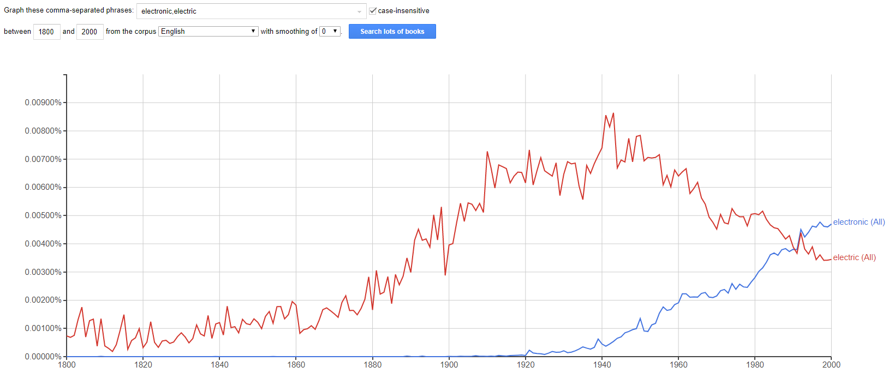

# What did lobsters suddenly do in 1911?

# _civil war_ vs _Civil War_ _~1600-2000_

# `Electric` or `electronic`?

# Weekdays

* https://books.google.com/ngrams

Does cherry-picking date and smoothing ranges inform or deceive?
