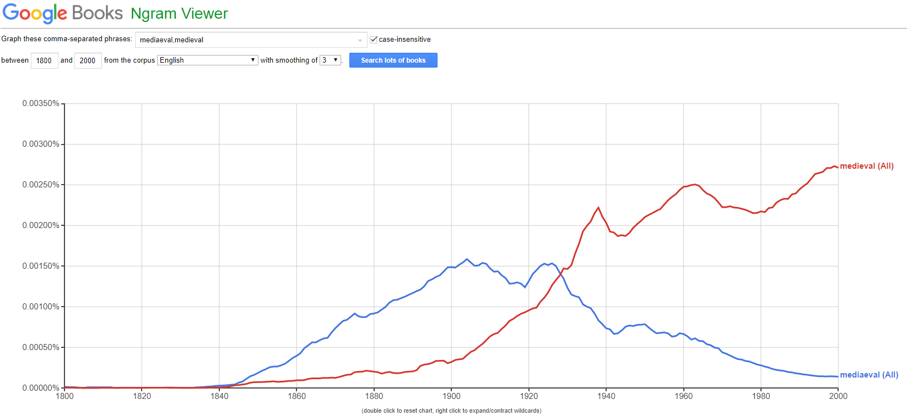
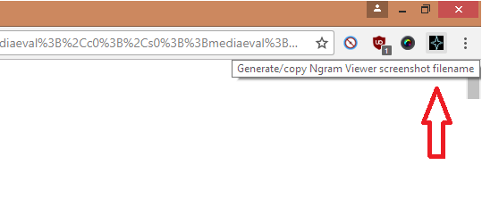
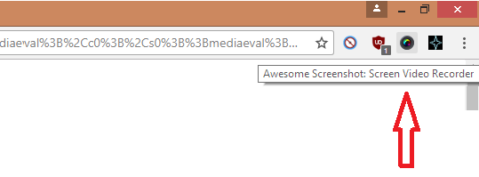
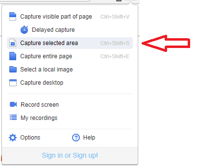
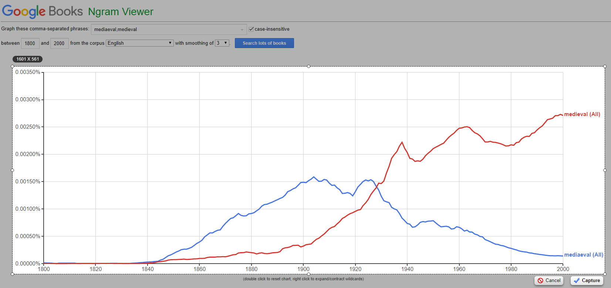
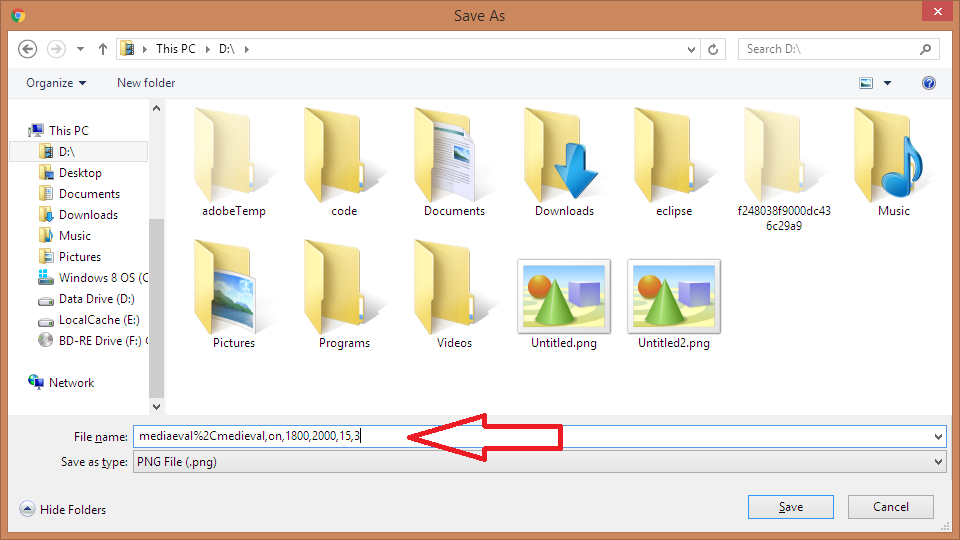

Chrome extension to generate a file name from a Google Ngram Viewer URL.

This keeps some key data in which can later be picked up and parsed by a script to generate a CSV or markdown or something.

Data kept:

- n-grams
- case insensitive (on/off)
- start year (range start)
- end year (range end)
- corpus ID
- smoothing

Allows me to have a quicker workflow that looks something like this:

